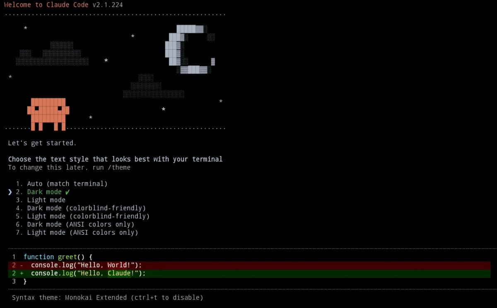

# Claude Code para Termux — Instalación nativa en Android

<p align="center">
  
</p>

**Instalación nativa de Claude Code en Termux para Android ARM64 (aarch64).**
Sin proot, sin máquinas virtuales, sin Cloud Shell. Obtén el asistente de IA de
Anthropic funcionando directamente en tu terminal Android.

Anthropic publica Claude Code como un binario **glibc** para Linux ARM64 y ya
no existe una versión que funcione con el `npm install` tradicional en Termux
(issue [anthropics/claude-code#50270](https://github.com/anthropics/claude-code/issues/50270)).
Este proyecto descarga el **binario oficial** de Anthropic y lo ejecuta con un
**launcher nativo Android** a través de la capa glibc de Termux. Usa varias
fuentes de descarga por prioridad:

1. **Vendor oficial** — registry npm de `@anthropic-ai/claude-code-linux-arm64`
   (siempre la última versión)
2. **Espejo propio** — Release de este repositorio
3. **Caché local** — `~/.cache/claude-code/` (se guarda tras la primera instalación)

Corre de forma nativa en Android ARM64.

---

## Guía para principiantes en Termux

¿Es tu primera vez con Termux? Sigue estos pasos antes de instalar Claude Code:

### 1. Instala Termux desde F-Droid

Termux **no debe instalarse desde Google Play** (esa versión está desactualizada y rota).
Instálalo desde el repositorio oficial:

- Descarga **F-Droid**: <https://f-droid.org/>
- Dentro de F-Droid busca **Termux** e instálalo
- También puedes descargar el APK directo: <https://f-droid.org/packages/com.termux/>

### 2. Actualiza los paquetes

Abre Termux y ejecuta:

```bash
pkg update && pkg upgrade -y
```

### 3. Instala Git (para clonar el instalador)

```bash
pkg install git -y
```

El instalador (`install.sh`) instala automáticamente `curl`, `tar`, `file` y
`clang` si no están presentes, así que no hace falta instalarlos a mano.

### 4. Verifica tu arquitectura

Claude Code solo funciona en dispositivos **ARM64 (aarch64)**:

```bash
uname -m
```

Debe mostrar `aarch64`. Si muestra `armv7l` o `x86_64`, este instalador no es compatible.

### 5. (Opcional) Da acceso al almacenamiento

Solo si quieres que Termux acceda a tus archivos:

```bash
termux-setup-storage
```

### 6. ¡Listo para instalar Claude Code!

Con Termux actualizado y git instalado, continúa con la sección de
[Instalación](#instalacion) de abajo.

---

## Requisitos

- **Termux** instalado desde [F-Droid](https://f-droid.org/packages/com.termux/)
  (no desde Google Play)
- **Dispositivo Android ARM64** (aarch64)
- **Git** para clonar el repositorio (`pkg install git -y`) o descargar el ZIP
- **Conexion a internet** para descargar los binarios (~290MB) y la capa glibc
- Espacio libre: ~450MB

> **Nota:** el instalador instala automáticamente las herramientas necesarias
> (`curl`, `tar`, `file`, `clang`) con `pkg` si no están presentes. No hace
> falta instalarlas a mano.

---

## Instalación

### Opcion A: Usuario nuevo en Termux

```bash
# 1. Actualizar e instalar dependencias
pkg update && pkg upgrade -y
pkg install git -y   # solo para clonar; el instalador instala lo demas

# 2. Clonar el repositorio
git clone https://github.com/sebastianl1/claude-code-termux.git
cd claude-code-termux

# 3. Ejecutar el instalador (instala automaticamente lo que falte)
bash install.sh
```

### Opcion B: Ya usas Termux

```bash
git clone https://github.com/sebastianl1/claude-code-termux.git
cd claude-code-termux
bash install.sh
```

El instalador es interactivo y te guiara paso a paso:

1. Verifica el entorno (Termux, arquitectura, dependencias)
2. Instala la capa glibc de Termux (repositorio oficial `glibc-repo`)
3. Descarga el binario oficial (vendor -> espejo -> caché)
4. Compila el launcher nativo Android
5. Ajusta `~/.claude/settings.json` (auto-updates desactivado)
6. Verifica la instalación

---

## Que instala

| Componente | Ruta | Descripcion |
|------------|------|-------------|
| `claude` | `$PREFIX/bin/claude` | Launcher nativo Android (C, compilado) |
| `claude.real` | `$PREFIX/share/claude/` | Binario real de Claude Code (build glibc) |

### Como funciona

El binario `claude` es un launcher compilado nativamente para Android (Bionic libc)
que se encarga de:

- Ejecutar el binario oficial de Anthropic (`claude.real`) a través del cargador
  dinámico glibc de Termux (`ld-linux-aarch64.so.1`)
- Apuntar al almacén de certificados TLS de Termux (`SSL_CERT_FILE`)
- Configurar `TMPDIR`/`CLAUDE_CODE_TMPDIR` al prefijo de Termux (no hay `/tmp` escribible)
- Configurar `CLAUDE_CODE_EXECPATH` para que los subprocesos (grep/find/rg) se
  re-ejecuten a través del launcher
- Desactivar el auto-updater (`DISABLE_AUTOUPDATER=1`), que de otro modo
  sobrescribiría el binario con uno glibc que no puede ejecutarse en Android

Todo esto sin necesidad de `proot`, wrappers manuales ni configuraciones complejas.

---

## Uso

### Iniciar Claude Code

```bash
claude
```

### Verificar version

```bash
claude --version
```

### Iniciar sesión con Anthropic

```bash
claude
```

En la primera ejecución, Claude Code te guiará para autenticarte con tu cuenta
de Anthropic (OAuth) o puedes usar una clave de API:

```bash
export ANTHROPIC_API_KEY=tu_clave
claude
```

### Comandos principales

| Comando | Descripcion |
|---------|-------------|
| `claude` | Iniciar la TUI interactiva |
| `claude "pregunta"` | Consulta directa sin entrar a la TUI |
| `claude --version` | Mostrar version |
| `claude --help` | Ayuda y comandos |
| `bash install.sh` | Actualizar a la ultima version |

---

## Solucion de problemas

### Error: `OAuth error: getaddrinfo ETIMEOUT platform.claude.com`

Este error aparece al iniciar sesion (OAuth o API key) y significa que el
**resolver DNS no respondio a tiempo** durante la peticion de autenticacion.
No es un fallo del instalador: la instalacion, el launcher y el binario
funcionan; es un problema del DNS de la red en el momento del login.

Causas mas comunes:

1. **La red bloquea o no responde a los nameservers configurados** (p. ej.
   ISPs, redes corporativas o cautivas que filtran DNS externos, VPNs).
2. **Falta ruta IPv6** en el dispositivo: el runtime puede intentar conectar
   por IPv6 y quedarse colgado hasta el timeout.
3. Intermitencia de DNS (picos de latencia o caidas del operador).

El instalador ya configura DNS de forma robusta:
`$PREFIX/etc/resolv.conf` con multiples servidores
(`1.1.1.1`, `9.9.9.9`, `8.8.8.8`, `8.8.4.4`, `208.67.222.222`) y
`options timeout:1 attempts:2 rotate` para que un servidor lento no cuelgue
la resolucion, y preferencia IPv4 en `gai.conf`.

Si aun asi ves el error, diagnostica:

```bash
# 1. Verifica que el DNS este bien configurado
cat $PREFIX/etc/resolv.conf

# 2. Prueba resolver el host con la capa glibc (la que usa Claude Code)
$PREFIX/glibc/bin/getent ahosts platform.claude.com

# 3. Prueba conexion real
curl -sI --max-time 10 https://platform.claude.com
```

Soluciones:

- Cambia de red (WiFi <-> datos moviles) o reinicia el router.
- Usa una VPN si tu ISP bloquea DNS externos.
- Reintenta el login pasados unos minutos (intermitencia).
- Como ultimo recurso, reinicia el dispositivo para renovar la configuracion
  de red de Android.

> Nota: `curl` y el resto de herramientas nativas usan el DNS de Android
> (Bionic), por eso pueden funcionar mientras Claude Code falla: el binario
> de Claude Code usa la capa glibc, que lee `$PREFIX/etc/resolv.conf`.

---

### El navegador no se abre al iniciar sesion (OAuth)

Al elegir una opcion de login (por ejemplo "Anthropic Console"), Claude Code
intenta abrir el navegador automaticamente para completar la autenticacion.

En Termux, el `xdg-open` del sistema usa `am broadcast` y no siempre levanta
el navegador desde el binario glibc de Claude Code. El instalador resuelve
esto automaticamente:

- Instala `$PREFIX/share/claude/bin/xdg-open`, un wrapper que llama a
  `am start` (la misma mecanica que `termux-open-url`) y abre el navegador
  Android de verdad.
- El launcher configura `BROWSER=termux-open-url` y pone ese wrapper primero
  en el `PATH`, asi Claude Code lo usa tanto si respeta `$BROWSER` como si
  invoca `xdg-open` directamente.

Si aun asi no se abre, pega la URL manualmente en el navegador. Ten en
cuenta que el codigo de verificacion que muestra la pagina **expira en
aproximadamente 1 minuto**, asi que copialo y pegalo en Termux de inmediato,
sin cerrar `claude`.

---

## Etiquetas y palabras clave

Proyecto orientado a: **Termux**, **Android**, **Claude Code**, **Anthropic**,
**inteligencia artificial**, **asistente de IA en terminal**, **aarch64**,
**ARM64**, **glibc**, **claude.ai**, **instalación sin proot**.
Búsquedas frecuentes: "claude code termux", "instalar claude code en android",
"claude termux", "claude code android", "anthropic termux".

---

## Dependencias y resiliencia

El instalador depende de recursos externos de terceros. Para que la herramienta
siga funcionando si alguno desaparece, hay **3 capas de protección**:

| Capa | Qué hace |
|------|----------|
| **Fuente primaria** | Descarga el binario oficial desde el registry npm de Anthropic (siempre `latest`) |
| **Mirror propio** | Si npm falla, descarga el mismo tarball desde un release de **este repositorio** (`claude-<version>`) |
| **Caché local** | Si las dos anteriores fallan, instala desde `~/.cache/claude-code/` (se guarda tras la primera instalación) |

### Qué pasa si el registry npm de Anthropic desaparece

- Quienes ya instalaron claude alguna vez: ejecuta `bash install.sh --offline`
  no es necesario — el instalador intenta automáticamente npm → mirror → caché.
- El mirror se actualiza manualmente con `bash scripts/mirror.sh`.

### Sincronizar el mirror (cuando salga versión nueva de Anthropic)

```bash
bash scripts/mirror.sh          # última versión
bash scripts/mirror.sh 2.1.224  # versión concreta
```

Esto descarga, verifica, sube el tarball al release del propio repo y actualiza
`versions.json`. Requiere `gh` autenticado.

---

## Desinstalación

Para desinstalar Claude Code:

```bash
bash install.sh --uninstall
```

Esto elimina el launcher y el binario de `$PREFIX/`. Si también quieres eliminar
la configuración:

```bash
rm -rf ~/.claude
```

Para eliminar los respaldos:

```bash
rm -rf ~/backups/claude.backup.*
```

---

## Estructura del proyecto

```
claude-code-termux/
├── imagenes/
│   └── ClaudeCode.jpg     # Banner del proyecto
├── docs/                   # Landing page (GitHub Pages) con i18n
│   ├── index.html          # Landing multilingüe (ES, EN, PT, FR, DE, ZH)
│   ├── lang/               # Diccionarios por idioma
│   └── robots.txt, sitemap.xml
├── scripts/
│   └── mirror.sh          # Sincroniza el mirror de binarios (copia de seguridad)
├── versions.json          # Manifest de versiones + SHA256
├── launcher.c             # Launcher nativo Android
├── install.sh             # Script de instalacion
├── README.md              # Este archivo
└── LICENSE                # Licencia MIT
```

---

## Autor

**Sebastian Laguna** — Creador y mantenedor del proyecto

---

## Comunidad

- [CONTRIBUTING.md](CONTRIBUTING.md) — Guia para contribuir
- [SECURITY.md](SECURITY.md) — Politica de seguridad
- [CODE_OF_CONDUCT.md](CODE_OF_CONDUCT.md) — Codigo de conducta
- [CHANGELOG.md](CHANGELOG.md) — Historial de versiones

---

## Creditos

- **[anthropics/claude-code](https://github.com/anthropics/claude-code)** —
  Asistente de IA de Anthropic
- **[termux/glibc-packages](https://github.com/termux-pacman/glibc-packages)** —
  Capa glibc para Termux
- **[gtbuchanan/claude-code-termux](https://github.com/gtbuchanan/claude-code-termux)** —
  Referencia de la comunidad para ejecutar el binario glibc en Termux

---

## Licencia

Este proyecto está bajo la licencia MIT. Ver el archivo [LICENSE](LICENSE).
El binario de Claude Code es propiedad de Anthropic y se descarga directamente
de sus fuentes oficiales; este proyecto no lo redistribuye.
